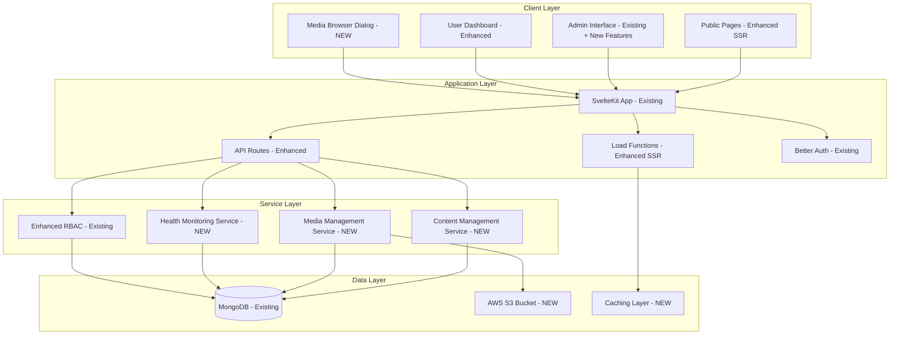

# Design Document

## Overview

This design extends the existing Magickit universal template foundation to implement dynamic content management capabilities. Building upon the established SvelteKit architecture with Better Auth, shadcn-svelte components, and MongoDB integration, this system transforms static content into a fully dynamic, manageable platform while maintaining consistency with existing UI/UX patterns and component structures.

The design focuses on enhancing the current template with:
- **Dynamic Content Management**: Transform static pages into manageable content
- **Server-Side Rendering**: Optimize public pages with SSR for performance and SEO
- **Media Management**: Professional media handling with Sharp processing and S3 storage
- **System Health Monitoring**: Real-time monitoring and alerting capabilities
- **Mock Data Replacement**: Connect all existing mock features to real services

This builds directly on the existing foundation without disrupting the established authentication flow, admin navigation structure, or component patterns.

## Architecture

### Existing Foundation Integration
This design builds upon the established Magickit architecture:
- **SvelteKit** with Svelte 5 and existing routing structure
- **Better Auth** with MongoDB adapter and RBAC system
- **Tailwind CSS 4** with established design system
- **shadcn-svelte** component library and patterns
- **MongoDB** with existing dbClient and models structure
- **Sharp** already included in dependencies for image processing

### Enhanced Architecture



### Technology Stack Enhancement
Building on existing dependencies:
- **Frontend**: Existing SvelteKit + Svelte 5 setup
- **Authentication**: Existing Better Auth with enhanced RBAC
- **Database**: Existing MongoDB with extended schemas
- **UI Components**: Existing shadcn-svelte components
- **Image Processing**: Existing Sharp dependency (already in package.json)
- **Storage**: AWS S3 for media files (NEW)
- **Caching**: Redis for performance optimization (NEW)
- **Monitoring**: Custom metrics collection using existing patterns (NEW)

## UI/UX Design Principles

### Adherence to Established Patterns
All new components and features must follow the existing Magickit design principles:

1. **Consistency with Existing Components**: Use established shadcn-svelte patterns
2. **Typography Hierarchy**: Follow existing `text-2xl`, `text-lg`, `text-sm` scale
3. **Color System**: Use existing primary, secondary, muted, and destructive variants
4. **Spacing Hierarchy**: Maintain `gap-6`, `gap-4`, `gap-2` and `p-6`, `p-4`, `p-0` patterns
5. **Component Patterns**: Follow existing table, form, button, and icon conventions
6. **Loading/Empty/Error States**: Use established patterns from existing admin pages

### Enhanced Admin Navigation
Building on the existing AppSidebar structure, add new navigation groups:

```typescript
// Extend existing navMain array in app-sidebar.svelte
const enhancedNavMain = [
  // ... existing navigation items
  {
    title: 'Content Management',
    url: '/admin/content',
    icon: FileTextIcon,
    items: [
      { title: 'Pages', url: '/admin/content/pages' },
      { title: 'Components', url: '/admin/content/components' },
      { title: 'Menus', url: '/admin/content/menus' },
      { title: 'Content Types', url: '/admin/content/types' }
    ]
  },
  {
    title: 'Media Management',
    url: '/admin/media',
    icon: ImageIcon,
    items: [
      { title: 'Media Library', url: '/admin/media' },
      { title: 'Upload Files', url: '/admin/media/upload' },
      { title: 'Organize Folders', url: '/admin/media/folders' }
    ]
  },
  {
    title: 'System Health',
    url: '/admin/system',
    icon: ActivityIcon,
    items: [
      { title: 'System Status', url: '/admin/system/status' },
      { title: 'Real-time Monitoring', url: '/admin/system/monitoring' },
      { title: 'System Logs', url: '/admin/system/logs' },
      { title: 'Performance Metrics', url: '/admin/system/performance' }
    ]
  }
];
```

## Components and Interfaces

### 1. Dynamic Content Management System

#### Content Type Schema (MongoDB Integration)
Following existing MongoDB patterns with ObjectId:

```typescript
import { ObjectId } from 'mongodb';

interface ContentType {
  _id: ObjectId;
  name: string;
  slug: string;
  fields: ContentField[];
  template: string;
  createdAt: Date;
  updatedAt: Date;
}

interface ContentField {
  _id: ObjectId;
  name: string;
  type: 'text' | 'richtext' | 'image' | 'video' | 'select' | 'boolean' | 'date';
  required: boolean;
  validation?: ValidationRule[];
  options?: string[]; // for select fields
}

interface ContentInstance {
  _id: ObjectId;
  contentTypeId: ObjectId; // Reference to ContentType
  slug: string;
  data: Record<string, any>;
  status: 'draft' | 'published' | 'archived';
  publishedAt?: Date;
  createdAt: Date;
  updatedAt: Date;
}
```

#### Content Management Service (Following Existing Patterns)
Using established database client and collection patterns:

```typescript
import db from '$lib/db/dbClient';
import { ObjectId } from 'mongodb';

class ContentManagementService {
  private contentTypesCollection = db.collection<ContentType>('contentTypes');
  private contentInstancesCollection = db.collection<ContentInstance>('contentInstances');

  async createContentType(type: Omit<ContentType, '_id' | 'createdAt' | 'updatedAt'>): Promise<ContentType> {
    const contentType: ContentType = {
      _id: new ObjectId(),
      ...type,
      createdAt: new Date(),
      updatedAt: new Date()
    };
    
    await this.contentTypesCollection.insertOne(contentType);
    return contentType;
  }

  async updateContentType(id: string | ObjectId, updates: Partial<ContentType>): Promise<ContentType | null> {
    const objectId = typeof id === 'string' ? new ObjectId(id) : id;
    
    const result = await this.contentTypesCollection.findOneAndUpdate(
      { _id: objectId },
      { $set: { ...updates, updatedAt: new Date() } },
      { returnDocument: 'after' }
    );
    
    return result;
  }

  async deleteContentType(id: string | ObjectId): Promise<boolean> {
    const objectId = typeof id === 'string' ? new ObjectId(id) : id;
    const result = await this.contentTypesCollection.deleteOne({ _id: objectId });
    return result.deletedCount > 0;
  }

  async getContentTypes(): Promise<ContentType[]> {
    return await this.contentTypesCollection.find({}).toArray();
  }

  async createContent(content: Omit<ContentInstance, '_id' | 'createdAt' | 'updatedAt'>): Promise<ContentInstance> {
    const contentInstance: ContentInstance = {
      _id: new ObjectId(),
      ...content,
      createdAt: new Date(),
      updatedAt: new Date()
    };
    
    await this.contentInstancesCollection.insertOne(contentInstance);
    return contentInstance;
  }

  async getContentBySlug(slug: string): Promise<ContentInstance | null> {
    return await this.contentInstancesCollection.findOne({ 
      slug, 
      status: 'published' 
    });
  }

  async publishContent(id: string | ObjectId): Promise<ContentInstance | null> {
    const objectId = typeof id === 'string' ? new ObjectId(id) : id;
    
    return await this.contentInstancesCollection.findOneAndUpdate(
      { _id: objectId },
      { 
        $set: { 
          status: 'published', 
          publishedAt: new Date(),
          updatedAt: new Date() 
        } 
      },
      { returnDocument: 'after' }
    );
  }
}

// Export singleton instance following existing patterns
export const contentService = new ContentManagementService();
```

### 2. Server-Side Rendering Implementation

#### Enhanced SSR Load Functions (Building on Existing Structure)
Enhance existing public pages to support dynamic content:

```typescript
// src/routes/[...slug]/+page.server.ts
import { contentService } from '$lib/services/content';
import { error } from '@sveltejs/kit';
import type { PageServerLoad } from './$types';

export const load: PageServerLoad = async ({ params, setHeaders }) => {
  const slug = params.slug || 'home';
  const content = await contentService.getContentBySlug(slug);
  
  if (!content) {
    throw error(404, 'Page not found');
  }
  
  // Set caching headers for performance (following existing patterns)
  setHeaders({
    'cache-control': 'public, max-age=300, s-maxage=3600'
  });
  
  return {
    content,
    meta: {
      title: content.data.title || 'Magickit',
      description: content.data.description || 'Universal web application template',
      image: content.data.featuredImage
    }
  };
};
```

#### Dynamic Route Handler (Following Existing Component Patterns)
```svelte
<!-- src/routes/[...slug]/+page.svelte -->
<script lang="ts">
  import { Card, CardContent } from '$lib/components/ui/card';
  import SEO from '$lib/components/SEO.svelte';
  import DynamicContentRenderer from '$lib/components/DynamicContentRenderer.svelte';
  
  interface Props {
    data: {
      content: ContentInstance;
      meta: {
        title: string;
        description: string;
        image?: string;
      };
    };
  }
  
  let { data }: Props = $props();
  
  $: content = data.content;
  $: meta = data.meta;
</script>

<SEO 
  title={meta.title}
  description={meta.description}
  ogImage={meta.image}
  includeOrganization={true}
/>

<div class="container mx-auto px-4 py-8">
  <DynamicContentRenderer {content} />
</div>
```

### 3. Enhanced Admin Navigation (Extending Existing Structure)

#### Integration with Existing AppSidebar
Extend the existing `app-sidebar.svelte` component by adding new navigation groups to the existing `navMain` array:

```typescript
// Update src/lib/components/app-sidebar.svelte
import {
  // ... existing imports
  FileTextIcon,
  ImageIcon,
  ActivityIcon,
  FolderIcon,
  UploadIcon,
  MonitorIcon,
  LogsIcon
} from '@lucide/svelte';

// Extend existing navMain array
const enhancedNavMain = [
  // ... existing navigation items (Dashboard, User Management, Access Control, etc.)
  
  // NEW: Content Management Group
  {
    title: 'Content Management',
    url: '/admin/content',
    icon: FileTextIcon,
    items: [
      { title: 'Pages', url: '/admin/content/pages' },
      { title: 'Components', url: '/admin/content/components' },
      { title: 'Menus', url: '/admin/content/menus' },
      { title: 'Content Types', url: '/admin/content/types' }
    ]
  },
  
  // NEW: Media Management Group
  {
    title: 'Media Management',
    url: '/admin/media',
    icon: ImageIcon,
    items: [
      { title: 'Media Library', url: '/admin/media' },
      { title: 'Upload Files', url: '/admin/media/upload' },
      { title: 'Organize Folders', url: '/admin/media/folders' }
    ]
  },
  
  // NEW: System Health Group
  {
    title: 'System Health',
    url: '/admin/system',
    icon: ActivityIcon,
    items: [
      { title: 'System Status', url: '/admin/system/status' },
      { title: 'Real-time Monitoring', url: '/admin/system/monitoring' },
      { title: 'System Logs', url: '/admin/system/logs' },
      { title: 'Performance Metrics', url: '/admin/system/performance' }
    ]
  },
  
  // ... existing navigation items continue
];
```

#### Mock Data Replacement Strategy
Replace existing mock data in admin dashboard with real data:

```typescript
// src/routes/admin/+page.svelte - Replace mock metrics
import { healthMonitoringService } from '$lib/services/health';
import { usersCollection } from '$lib/db/collections/users';

// Replace mock metrics with real data
async function loadRealMetrics() {
  const [systemStatus, userStats] = await Promise.all([
    healthMonitoringService.getSystemStatus(),
    usersCollection.getUserStats()
  ]);
  
  return {
    totalUsers: userStats.total,
    activeUsers: userStats.active,
    systemHealth: systemStatus.status,
    alerts: systemStatus.alerts.length
  };
}
```

### 4. Media Management System

#### Media Processing Pipeline (MongoDB Integration)
Following existing database patterns:

```typescript
import { ObjectId } from 'mongodb';

interface MediaFile {
  _id: ObjectId;
  filename: string;
  originalName: string;
  mimeType: string;
  size: number;
  width?: number;
  height?: number;
  folderId?: ObjectId; // Reference to MediaFolder
  s3Key: string;
  s3Url: string;
  variants: MediaVariant[];
  metadata: Record<string, any>;
  createdAt: Date;
  updatedAt: Date;
}

interface MediaVariant {
  _id: ObjectId;
  name: string; // 'thumbnail', 'medium', 'large', 'webp'
  width: number;
  height: number;
  format: string;
  quality: number;
  s3Key: string;
  s3Url: string;
  size: number;
}

interface MediaFolder {
  _id: ObjectId;
  name: string;
  parentId?: ObjectId; // Reference to parent MediaFolder
  path: string;
  createdAt: Date;
  updatedAt: Date;
}
```

#### Sharp Processing Service (Using Existing Dependency)
Leveraging the Sharp dependency already in package.json:

```typescript
import sharp from 'sharp'; // Already available in dependencies
import { ObjectId } from 'mongodb';

class MediaProcessingService {
  
  async processImage(buffer: Buffer, filename: string): Promise<ProcessedImage> {
    const variants = await Promise.all([
      this.createVariant(buffer, 'thumbnail', { width: 150, height: 150 }),
      this.createVariant(buffer, 'medium', { width: 800, height: 600 }),
      this.createVariant(buffer, 'large', { width: 1920, height: 1080 }),
      this.createWebPVariant(buffer, 'webp', { width: 1920, quality: 85 })
    ]);
    
    return {
      original: await this.optimizeOriginal(buffer),
      variants
    };
  }
  
  private async createVariant(
    buffer: Buffer, 
    name: string, 
    options: { width: number; height?: number; quality?: number }
  ): Promise<MediaVariant> {
    const processed = await this.sharp(buffer)
      .resize(options.width, options.height, { 
        fit: 'inside',
        withoutEnlargement: true 
      })
      .jpeg({ quality: options.quality || 90, mozjpeg: true })
      .toBuffer();
    
    return {
      _id: new ObjectId(),
      name,
      buffer: processed,
      width: options.width,
      height: options.height || options.width,
      format: 'jpeg',
      quality: options.quality || 90,
      size: processed.length
    };
  }
  
  private async createWebPVariant(
    buffer: Buffer,
    name: string,
    options: { width: number; quality: number }
  ): Promise<MediaVariant> {
    const processed = await this.sharp(buffer)
      .resize(options.width, null, { 
        fit: 'inside',
        withoutEnlargement: true 
      })
      .webp({ quality: options.quality })
      .toBuffer();
    
    return {
      _id: new ObjectId(),
      name,
      buffer: processed,
      width: options.width,
      format: 'webp',
      quality: options.quality,
      size: processed.length
    };
  }
}
```

#### S3 Upload Service
```typescript
class S3MediaService {
  private s3Client: S3Client;
  private bucketName: string;
  private cdnDomain: string;
  
  async uploadMedia(file: ProcessedImage, folder?: string): Promise<MediaFile> {
    const baseKey = folder ? `${folder}/${file.id}` : file.id;
    
    // Upload original
    const originalKey = `${baseKey}/original.${file.original.format}`;
    await this.uploadToS3(originalKey, file.original.buffer, file.original.mimeType);
    
    // Upload variants
    const variants = await Promise.all(
      file.variants.map(async (variant) => {
        const variantKey = `${baseKey}/${variant.name}.${variant.format}`;
        await this.uploadToS3(variantKey, variant.buffer, `image/${variant.format}`);
        
        return {
          ...variant,
          s3Key: variantKey,
          s3Url: `${this.cdnDomain}/${variantKey}`
        };
      })
    );
    
    return {
      _id: file._id,
      s3Key: originalKey,
      s3Url: `${this.cdnDomain}/${originalKey}`,
      variants,
      ...file.metadata
    };
  }
  
  private async uploadToS3(key: string, buffer: Buffer, contentType: string): Promise<void> {
    await this.s3Client.send(new PutObjectCommand({
      Bucket: this.bucketName,
      Key: key,
      Body: buffer,
      ContentType: contentType,
      CacheControl: 'public, max-age=31536000' // 1 year
    }));
  }
}
```

### 5. Media Browser Dialog Component (Following Existing Component Patterns)

#### Media Browser Interface (Svelte 5 Props Pattern)
```typescript
interface MediaBrowserProps {
  multiple?: boolean;
  accept?: string[]; // ['image/*', 'video/*']
  maxSize?: number;
  onSelect: (files: MediaFile[]) => void;
  onClose: () => void;
}

interface MediaBrowserState {
  currentFolder: MediaFolder | null;
  files: MediaFile[];
  folders: MediaFolder[];
  selectedFiles: MediaFile[];
  view: 'grid' | 'list';
  sortBy: 'name' | 'date' | 'size';
  sortOrder: 'asc' | 'desc';
  searchQuery: string;
  isUploading: boolean;
  uploadProgress: number;
}
```

#### Media Browser Component (Following Existing Patterns)
```svelte
<!-- MediaBrowserDialog.svelte -->
<script lang="ts">
  import { Dialog, DialogContent, DialogHeader, DialogTitle, DialogFooter } from '$lib/components/ui/dialog';
  import { Button } from '$lib/components/ui/button';
  import { Input } from '$lib/components/ui/input';
  import { Card, CardContent } from '$lib/components/ui/card';
  import { Badge } from '$lib/components/ui/badge';
  import { Loader2, Upload, Grid, List, Search } from '@lucide/svelte';
  import { mediaService } from '$lib/services/media';
  import MediaGrid from './MediaGrid.svelte';
  import MediaUpload from './MediaUpload.svelte';
  import FolderNavigation from './FolderNavigation.svelte';
  
  interface Props {
    open: boolean;
    multiple?: boolean;
    accept?: string[];
    maxSize?: number;
    onSelect: (files: MediaFile[]) => void;
    onClose: () => void;
  }
  
  let { 
    open = $bindable(),
    multiple = false, 
    accept = ['image/*'], 
    maxSize = 10 * 1024 * 1024,
    onSelect,
    onClose 
  }: Props = $props();
  
  let state = $state<MediaBrowserState>({
    currentFolder: null,
    files: [],
    folders: [],
    selectedFiles: [],
    view: 'grid',
    sortBy: 'date',
    sortOrder: 'desc',
    searchQuery: '',
    isUploading: false,
    uploadProgress: 0
  });
  
  async function loadMedia() {
    const { files, folders } = await mediaService.getMedia({
      folderId: state.currentFolder?._id,
      search: state.searchQuery,
      sortBy: state.sortBy,
      sortOrder: state.sortOrder
    });
    
    state.files = files;
    state.folders = folders;
  }
  
  async function handleUpload(files: FileList) {
    state.isUploading = true;
    
    try {
      for (let i = 0; i < files.length; i++) {
        const file = files[i];
        state.uploadProgress = (i / files.length) * 100;
        
        const uploadedFile = await mediaService.uploadFile(file, state.currentFolder?._id);
        state.files = [uploadedFile, ...state.files];
      }
    } finally {
      state.isUploading = false;
      state.uploadProgress = 0;
    }
  }
  
  function handleSelect() {
    onSelect(state.selectedFiles);
    onClose();
  }
</script>

<Dialog bind:open>
  <DialogContent class="max-w-6xl max-h-[80vh]">
    <DialogHeader>
      <DialogTitle class="text-2xl">Media Library</DialogTitle>
    </DialogHeader>
    
    <div class="grid grid-cols-1 lg:grid-cols-4 gap-6 h-[60vh]">
      <!-- Sidebar -->
      <div class="lg:col-span-1">
        <Card class="h-full">
          <CardContent class="p-4">
            <FolderNavigation 
              folders={state.folders}
              currentFolder={state.currentFolder}
              onFolderChange={(folder) => { state.currentFolder = folder; loadMedia(); }}
            />
          </CardContent>
        </Card>
      </div>
      
      <!-- Main Content -->
      <div class="lg:col-span-3 space-y-4">
        <!-- Toolbar -->
        <div class="flex flex-col sm:flex-row gap-4">
          <div class="flex-1">
            <div class="relative">
              <Search class="absolute left-2.5 top-2.5 h-4 w-4 text-muted-foreground" />
              <Input 
                bind:value={state.searchQuery}
                placeholder="Search media..."
                class="pl-8 transition-colors duration-200"
                oninput={loadMedia}
              />
            </div>
          </div>
          <div class="flex gap-2">
            <Button 
              variant={state.view === 'grid' ? 'default' : 'outline'}
              size="icon"
              onclick={() => state.view = 'grid'}
              class="transition-colors duration-200"
            >
              <Grid class="h-4 w-4" />
            </Button>
            <Button 
              variant={state.view === 'list' ? 'default' : 'outline'}
              size="icon"
              onclick={() => state.view = 'list'}
              class="transition-colors duration-200"
            >
              <List class="h-4 w-4" />
            </Button>
            <MediaUpload onUpload={handleUpload} {accept} {maxSize} />
          </div>
        </div>
        
        <!-- Media Grid -->
        <Card class="flex-1 overflow-hidden">
          <CardContent class="p-0 h-full">
            {#if state.isUploading}
              <div class="flex justify-center items-center py-12">
                <div class="text-center space-y-4">
                  <Loader2 class="h-8 w-8 animate-spin mx-auto text-primary" />
                  <p class="text-sm text-muted-foreground">Uploading... {state.uploadProgress}%</p>
                </div>
              </div>
            {:else}
              <MediaGrid 
                files={state.files}
                view={state.view}
                {multiple}
                bind:selectedFiles={state.selectedFiles}
              />
            {/if}
          </CardContent>
        </Card>
      </div>
    </div>
    
    <DialogFooter>
      <div class="flex items-center justify-between w-full">
        <div class="flex items-center gap-2">
          <Badge variant="secondary">
            {state.selectedFiles.length} file{state.selectedFiles.length !== 1 ? 's' : ''} selected
          </Badge>
        </div>
        <div class="flex gap-2">
          <Button variant="outline" onclick={onClose} class="transition-colors duration-200">
            Cancel
          </Button>
          <Button 
            onclick={handleSelect}
            disabled={state.selectedFiles.length === 0}
            class="transition-colors duration-200"
          >
            Select Files
          </Button>
        </div>
      </div>
    </DialogFooter>
  </DialogContent>
</Dialog>
```

### 6. System Health Monitoring

#### Monitoring Data Schema (MongoDB Integration)
```typescript
import { ObjectId } from 'mongodb';

interface SystemMetrics {
  _id: ObjectId;
  timestamp: Date;
  cpu: {
    usage: number; // percentage
    loadAverage: number[];
  };
  memory: {
    used: number; // bytes
    total: number; // bytes
    percentage: number;
  };
  disk: {
    used: number; // bytes
    total: number; // bytes
    percentage: number;
  };
  network: {
    bytesIn: number;
    bytesOut: number;
  };
  database: {
    connections: number;
    queryTime: number; // average ms
    slowQueries: number;
  };
  application: {
    responseTime: number; // average ms
    errorRate: number; // percentage
    requestsPerMinute: number;
  };
  createdAt: Date;
}

interface SystemAlert {
  _id: ObjectId;
  type: 'warning' | 'error' | 'critical';
  message: string;
  metric: string;
  threshold: number;
  currentValue: number;
  createdAt: Date;
  resolvedAt?: Date;
}
```

#### Health Monitoring Service (Following Existing Patterns)
```typescript
import db from '$lib/db/dbClient';
import { ObjectId } from 'mongodb';

class HealthMonitoringService {
  private metricsCollection = db.collection<SystemMetrics>('systemMetrics');
  private alertsCollection = db.collection<SystemAlert>('systemAlerts');
  private metricsCollector: MetricsCollector;
  private alertManager: AlertManager;
  
  async collectMetrics(): Promise<SystemMetrics> {
    const [cpu, memory, disk, network, database, application] = await Promise.all([
      this.metricsCollector.getCPUMetrics(),
      this.metricsCollector.getMemoryMetrics(),
      this.metricsCollector.getDiskMetrics(),
      this.metricsCollector.getNetworkMetrics(),
      this.metricsCollector.getDatabaseMetrics(),
      this.metricsCollector.getApplicationMetrics()
    ]);
    
    const metrics: SystemMetrics = {
      _id: new ObjectId(),
      timestamp: new Date(),
      cpu,
      memory,
      disk,
      network,
      database,
      application,
      createdAt: new Date()
    };
    
    // Store metrics
    await this.metricsCollection.insertOne(metrics);
    
    // Check for alerts
    await this.alertManager.checkThresholds(metrics);
    
    return metrics;
  }
  
  async getMetricsHistory(
    startDate: Date,
    endDate: Date,
    interval: '1m' | '5m' | '1h' | '1d' = '5m'
  ): Promise<SystemMetrics[]> {
    return await this.metricsCollector.getHistoricalMetrics(startDate, endDate, interval);
  }
  
  async getSystemStatus(): Promise<{
    status: 'healthy' | 'warning' | 'critical';
    alerts: SystemAlert[];
    uptime: number;
    lastCheck: Date;
  }> {
    const activeAlerts = await this.alertManager.getActiveAlerts();
    const uptime = process.uptime();
    
    let status: 'healthy' | 'warning' | 'critical' = 'healthy';
    if (activeAlerts.some(alert => alert.type === 'critical')) {
      status = 'critical';
    } else if (activeAlerts.some(alert => alert.type === 'error' || alert.type === 'warning')) {
      status = 'warning';
    }
    
    return {
      status,
      alerts: activeAlerts,
      uptime,
      lastCheck: new Date()
    };
  }
}
```

## Data Models

### MongoDB Collections (Extending Existing Database)
Building on the existing MongoDB structure with proper indexing:

```typescript
// Content Management Collections
interface ContentType {
  _id: ObjectId;
  name: string;
  slug: string; // Indexed for fast lookups
  fields: ContentField[];
  template: string;
  createdAt: Date;
  updatedAt: Date;
}

interface ContentInstance {
  _id: ObjectId;
  contentTypeId: ObjectId; // Indexed, references ContentType
  slug: string; // Indexed for fast public page lookups
  data: Record<string, any>;
  status: 'draft' | 'published' | 'archived'; // Indexed
  publishedAt?: Date; // Indexed for sorting
  createdAt: Date;
  updatedAt: Date;
}

// Media Management Collections
interface MediaFolder {
  _id: ObjectId;
  name: string;
  parentId?: ObjectId; // Indexed, references MediaFolder
  path: string; // Indexed for hierarchy queries
  createdAt: Date;
  updatedAt: Date;
}

interface MediaFile {
  _id: ObjectId;
  filename: string;
  originalName: string;
  mimeType: string; // Indexed for filtering
  size: number;
  width?: number;
  height?: number;
  folderId?: ObjectId; // Indexed, references MediaFolder
  s3Key: string;
  s3Url: string;
  variants: MediaVariant[];
  metadata: Record<string, any>;
  createdAt: Date; // Indexed for sorting
  updatedAt: Date;
}

// System Monitoring Collections
interface SystemMetrics {
  _id: ObjectId;
  timestamp: Date; // Indexed for time-series queries
  cpu: { usage: number; loadAverage: number[] };
  memory: { used: number; total: number; percentage: number };
  disk: { used: number; total: number; percentage: number };
  network: { bytesIn: number; bytesOut: number };
  database: { connections: number; queryTime: number; slowQueries: number };
  application: { responseTime: number; errorRate: number; requestsPerMinute: number };
  createdAt: Date;
}

interface SystemAlert {
  _id: ObjectId;
  type: 'warning' | 'error' | 'critical'; // Indexed
  message: string;
  metric: string;
  threshold: number;
  currentValue: number;
  createdAt: Date; // Indexed
  resolvedAt?: Date; // Indexed for active alerts
}

// Database Indexes (to be created during initialization)
const requiredIndexes = {
  contentTypes: [
    { slug: 1 }, // Unique index
    { createdAt: -1 }
  ],
  contentInstances: [
    { slug: 1 }, // Unique index for published content
    { contentTypeId: 1 },
    { status: 1 },
    { publishedAt: -1 },
    { createdAt: -1 }
  ],
  mediaFolders: [
    { parentId: 1 },
    { path: 1 },
    { createdAt: -1 }
  ],
  mediaFiles: [
    { folderId: 1 },
    { mimeType: 1 },
    { createdAt: -1 },
    { filename: 'text' } // Text index for search
  ],
  systemMetrics: [
    { timestamp: -1 },
    { createdAt: -1 }
  ],
  systemAlerts: [
    { type: 1 },
    { createdAt: -1 },
    { resolvedAt: 1 }
  ]
};
```

## Error Handling

### Integration with Existing Error Handling
Building on the existing SvelteKit error handling patterns:

```typescript
// Extend existing src/hooks.server.ts
import { healthMonitoringService } from '$lib/services/health';

export const handleError: HandleServerError = ({ error, event }) => {
  // Log error to existing monitoring system
  console.error('Server error', {
    error: error.message,
    stack: error.stack,
    url: event.url.pathname,
    userAgent: event.request.headers.get('user-agent')
  });
  
  // Also log to new health monitoring system
  healthMonitoringService.logError({
    message: error.message,
    stack: error.stack,
    url: event.url.pathname,
    userAgent: event.request.headers.get('user-agent') || '',
    timestamp: new Date()
  });
  
  // Return user-friendly error following existing patterns
  return {
    message: 'An unexpected error occurred',
    code: error.code || 'INTERNAL_ERROR'
  };
};

// Content-specific error handling
export class ContentError extends Error {
  constructor(
    message: string,
    public code: string,
    public statusCode: number = 500
  ) {
    super(message);
    this.name = 'ContentError';
  }
}

// Media processing error handling
export class MediaProcessingError extends Error {
  constructor(
    message: string,
    public originalError?: Error,
    public fileInfo?: { name: string; size: number; type: string }
  ) {
    super(message);
    this.name = 'MediaProcessingError';
  }
}

// Use existing Alert components for error display
// Following patterns from existing admin pages
{#if error}
  <Alert variant="destructive">
    <AlertCircle class="h-4 w-4" />
    <AlertDescription>{error}</AlertDescription>
  </Alert>
{/if}
```

## Testing Strategy

### Integration with Existing Testing Setup
Building on the existing Vitest and Playwright configuration:

### Unit Testing (Vitest)
- Content management service functions
- Media processing pipeline with Sharp
- System metrics collection
- Enhanced navigation component logic
- Database collection utilities

### Integration Testing (Playwright)
- SSR page rendering with dynamic content
- Media upload and processing workflow
- Enhanced admin interface CRUD operations
- System monitoring data collection
- Authentication flow with new features

### End-to-End Testing (Playwright)
- Complete content creation and publishing flow
- Media browser dialog functionality
- System health dashboard interactions
- Public page performance with dynamic content
- Mock data replacement verification

### Performance Testing
- SSR page load times with various content types
- Media processing performance with different file sizes
- Database query performance under load
- System monitoring overhead impact
- Existing performance audit scripts enhancement

### Component Testing (Following Existing Patterns)
```typescript
// Example test for MediaBrowserDialog component
import { render, screen } from '@testing-library/svelte';
import { describe, it, expect } from 'vitest';
import MediaBrowserDialog from '$lib/components/MediaBrowserDialog.svelte';

describe('MediaBrowserDialog Component', () => {
  it('renders media browser with proper structure', () => {
    render(MediaBrowserDialog, {
      open: true,
      onSelect: () => {},
      onClose: () => {}
    });
    
    expect(screen.getByText('Media Library')).toBeInTheDocument();
    expect(screen.getByPlaceholderText('Search media...')).toBeInTheDocument();
  });
});
```

## Security Considerations

### Integration with Existing Security
Building on the established Better Auth and RBAC system:

### Content Security
- Input validation for all content fields using existing validation patterns
- XSS prevention in rich text content
- CSRF protection for admin operations (existing)
- Role-based access control using existing Better Auth RBAC system
- Content approval workflows for non-admin users

### Media Security
- File type validation and sanitization using existing patterns
- Size limits and quota management
- S3 bucket security policies with proper IAM roles
- CDN security headers
- Virus scanning for uploaded files
- Watermarking for sensitive media

### System Monitoring Security
- Secure metrics collection endpoints using existing auth middleware
- Authentication for monitoring dashboards using existing admin role checks
- Sensitive data filtering in logs
- Alert notification security
- Rate limiting for monitoring endpoints

### Enhanced RBAC Integration
```typescript
// Extend existing RBAC system with new permissions
export const ENHANCED_SYSTEM_PERMISSIONS = {
  // Content management permissions
  CONTENT_TYPE_CREATE: { resource: 'content-type', action: 'create' as const },
  CONTENT_TYPE_READ: { resource: 'content-type', action: 'read' as const },
  CONTENT_TYPE_UPDATE: { resource: 'content-type', action: 'update' as const },
  CONTENT_TYPE_DELETE: { resource: 'content-type', action: 'delete' as const },
  
  // Media management permissions
  MEDIA_UPLOAD: { resource: 'media', action: 'create' as const },
  MEDIA_READ: { resource: 'media', action: 'read' as const },
  MEDIA_UPDATE: { resource: 'media', action: 'update' as const },
  MEDIA_DELETE: { resource: 'media', action: 'delete' as const },
  
  // System monitoring permissions
  SYSTEM_METRICS_READ: { resource: 'system-metrics', action: 'read' as const },
  SYSTEM_ALERTS_MANAGE: { resource: 'system-alerts', action: 'manage' as const }
} as const;
```

### API Security
- All new API endpoints protected by existing auth middleware
- Input validation using existing validation patterns
- Rate limiting for resource-intensive operations
- Audit logging for all admin actions using existing audit system